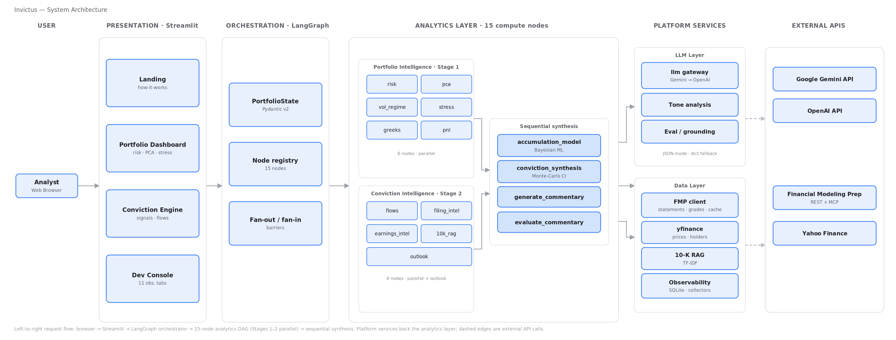

# INVICTUS

**Institutional-Grade Equity Portfolio Intelligence Platform**

A multi-stage analytical pipeline built on LangGraph that orchestrates 15 specialized compute nodes across a parallel DAG — producing risk analytics, conviction signals, and AI-generated commentary for equity portfolios.

**[Live Demo →](https://invictus-7iskuf67l87iksp8vunmag.streamlit.app/)**

Upload a CSV or try the built-in demo portfolio (AAPL, AMD, META, TSLA, SMH) to see the full pipeline in action.

---

## What It Does

Invictus takes a portfolio of equity holdings (tickers, shares, cost basis) and runs a three-stage analytical pipeline:

**Portfolio Intelligence** — 7 risk dimensions computed in parallel: VaR/CVaR at 95%, Sharpe and Sortino ratios, max drawdown, beta, marginal contribution to risk (MCTR), PCA factor decomposition, K-Means volatility regime detection, stress testing against 5 historical scenarios, Black-Scholes Greeks, and P&L attribution decomposed into market, sector, and idiosyncratic components.

**Conviction Intelligence** — Per-ticker deep analysis across 4 signal sources: institutional flow scoring (insider transactions, fund accumulation trends, smart money concentration), fundamental analysis via yfinance and FMP, management outlook extraction from earnings transcripts and press releases (6 dimensions with credibility gating), and SEC 10-K retrieval-augmented analysis.

**Bayesian Synthesis** — A conviction engine that combines all upstream signals into a single outperformance probability per ticker, with dynamic signal weighting, cross-signal agreement detection, and Monte Carlo confidence intervals.

An AI commentary layer and numerical grounding evaluator sit on top — the LLM generates a portfolio narrative, and the eval harness verifies every number in it traces back to an upstream node output.

---

## Architecture



The platform is organized as six layers — a Streamlit presentation tier, a LangGraph orchestration tier, and the analytics, LLM, and data layers beneath it — calling out to FMP, Yahoo Finance, and the Gemini/OpenAI APIs.

Built on **LangGraph StateGraph** with fan-out/fan-in edges and barrier nodes for parallel execution. 15 registered compute nodes + 2 synchronization barriers. Stages 1–2 run up to 10 nodes in parallel; stages 3–7 execute sequentially.

The shared state container (`PortfolioState`) is a Pydantic v2 model — each node reads what it needs and writes its outputs without coupling to other nodes.

---

## Pipeline Nodes

| Node | What It Computes |
|------|-----------------|
| **Risk** | Annualized vol, Sharpe, Sortino, VaR/CVaR (95%), max drawdown, beta, MCTR, correlation matrix |
| **PCA** | Principal component decomposition — identifies hidden factor exposures across holdings |
| **Vol Regime** | K-Means clustering on rolling volatility → Low / Medium / High regimes with transition history |
| **Stress Test** | Replay against 5 historical scenarios (COVID crash, 2022 rate shock, tech drawdown, semi selloff, SVB crisis) |
| **Greeks** | Delta, gamma, vega, theta — Black-Scholes options-implied risk sensitivities |
| **P&L Attribution** | Return decomposition into market, sector, and idiosyncratic components |
| **Flow** | 3-bucket scoring: insider intelligence (0.35), fund accumulation trend (0.40), capital concentration (0.25) |
| **Filing Intel** | Fundamental signals from yfinance financials + FMP analyst grades and estimate revisions |
| **Earnings Intel** | Earnings surprise scoring + management tone analysis via LLM with dictionary fallback |
| **10-K RAG** | TF-IDF retrieval over chunked SEC filings — extracts business drivers, risk factors, moat analysis |
| **Outlook** | Management outlook across 6 dimensions (guidance, capex, margins, competitive, demand, risk) with credibility gating |
| **ML Accumulation** | Bayesian signal model — sequential updating with log-linear Bayes factors over fundamental + technical features |
| **Synthesis** | Dynamic-weighted composite of 4 signal sources → single conviction probability with Monte Carlo CI |
| **Commentary** | LLM-generated portfolio narrative from all upstream signals |
| **Eval** | Numerical grounding checks + cross-node consistency + hallucination detection |

---

## Flow Scoring — Methodology Detail

The institutional flow node is the most methodologically complex module. Three scored sub-components:

**Insider Intelligence (0.35)** — Signal comes from what percentage of their stake an insider transacted, not raw dollar value. A CEO selling $340M of AAPL is noise if it's 1% of their stake. Role-weighted (CEO/CFO = 3×, VP/Director = 2×) with 90-day exponential time decay and materiality-based exit detection.

**Fund Accumulation Trend (0.40)** — Institutional holders classified as smart money (hedge funds), active (stock-picking), or passive (index). Active fund overrides handle active arms of passive parents (e.g., Fidelity Contrafund ≠ passive). Value-weighted breadth scoring replaces naive equal-weighting.

**Capital Concentration (0.25)** — Smart money as fraction of institutional base, centered at 15% = neutral. Confidence fade-in below 5% for mega-caps where passive dominance makes the metric unreliable. Smooth sigmoid replaces hard discontinuity at the 2% threshold.

---

## Evaluation & Observability

Accessible via the Developer Console (`?dev=invictus` URL parameter), the platform includes:

**Evaluation** — Numerical grounding evaluator (verifies LLM numbers trace to upstream outputs, target >85% grounding rate), cross-node consistency analysis, answer stability measurement (coefficient of variation across runs), LLM cost breakdowns, and a walk-forward backtest engine that replays conviction signals against actual forward returns.

**Observability** — 6 telemetry collectors (node latency, LLM tokens, ML drift, conviction signals, data health, sessions) writing to a local SQLite store. 3 diagnostic analyzers (calibration, drift, hallucination) process telemetry into alerts.

**Dev Console** — 11 tabs: Architecture, Node Performance, LLM Quality, ML Monitoring, Conviction Analytics, Conviction Intel, Session Analytics, Data Health, Cost Analysis, Eval Metrics, Backtest.

---

## Tech Stack

| Layer | Technology |
|-------|-----------|
| Orchestration | LangGraph StateGraph (fan-out/fan-in DAG) |
| Frontend | Streamlit with custom design system (tokens, components, charts) |
| LLM | Google Gemini 2.0 Flash (primary) → OpenAI GPT-4o-mini (fallback) |
| RAG | TF-IDF retrieval (scikit-learn) over chunked SEC filings |
| ML | Bayesian signal model (SciPy/NumPy) — no sklearn ensemble |
| Quant | NumPy, Pandas, scikit-learn (K-Means, PCA) |
| Market Data | yfinance (prices, holders, options) + FMP API (filings, transcripts, insiders, estimates) |
| Visualization | Plotly, Matplotlib, Seaborn |
| State | Pydantic v2 typed state container |
| Observability | SQLite + custom collectors/analyzers |

---

## Project Structure

```
invictus/
├── agents/              # 15 compute nodes + orchestrator + state schema
│   ├── orchestrator.py  # LangGraph StateGraph — 15 nodes, 2 barriers, 7 stages
│   ├── graph_state.py   # Pydantic PortfolioState container
│   ├── risk_agent.py    # VaR, CVaR, Sharpe, Sortino, drawdown, MCTR
│   ├── flow_agent.py    # 3-bucket institutional flow scoring
│   ├── synthesis_agent.py # Bayesian conviction synthesis + Monte Carlo
│   ├── ml_agent.py      # Bayesian accumulation signal model (v4)
│   ├── outlook_agent.py # Management outlook — 6 dimensions + credibility
│   └── ...              # 8 more nodes
├── pages/
│   ├── landing/         # How It Works — system architecture + methodology
│   ├── portfolio/       # 7 sub-tabs: dashboard, risk, PCA, vol, stress, greeks, P&L
│   ├── conviction/      # 4 sub-tabs: engine, flows, outlook, transcripts
│   ├── dev_analytics/   # 11 sub-tabs: architecture through backtest
│   └── hypo_simulator.py # Allocation Engine — hypothetical what-if analysis
├── observability/
│   ├── collectors/      # 6 telemetry collectors (agent, LLM, ML, conviction, data, session)
│   └── analyzers/       # 3 diagnostic analyzers (calibration, drift, hallucination)
├── evaluation/          # Grounding, consistency, cost, backtest tracker
├── backtest/            # Walk-forward engine: config, data loader, runner, analyzer
├── design/              # Design system — tokens, components, formatters, charts, nav
├── data/
│   ├── demo/            # Cached demo data for Streamlit Cloud fallback
│   └── portfolio_loader.py
├── rag/                 # SEC 10-K retrieval (TF-IDF + chunking)
├── llm.py               # Centralized LLM gateway (Gemini → OpenAI fallback)
├── fmp_client.py        # Shared FMP API client
└── config.py            # All constants, API keys, thresholds
app.py                   # Streamlit entry point — thin routing shell
```

**106 Python files · ~21,700 lines of code**

---

## Running Locally

Requires **Python 3.10+**.

```bash
git clone https://github.com/samirrc2/Invictus.git
cd Invictus

python -m venv venv
source venv/bin/activate
pip install -r requirements.txt

# API keys — at minimum, one LLM key is needed for AI features
cp .env.example .env
# OPENAI_API_KEY=sk-...       (LLM fallback)
# GEMINI_API_KEY=AI...        (primary LLM)
# FMP_API_KEY=...             (filings, transcripts, insider data)

streamlit run app.py
```

The app opens with a landing page explaining the system architecture and methodology. Click **Demo Mode** to load a pre-configured 5-stock portfolio and run the full pipeline, or upload a CSV with columns `Ticker, Shares, CostBasis`.

---

## Design Decisions

**LangGraph over sequential execution** — The fan-out/fan-in pattern runs 6 risk nodes simultaneously in Stage 1, then 4 conviction nodes in Stage 2. Barrier nodes ensure downstream nodes see complete upstream results.

**Materiality-based insider scoring** — Raw dollar values mislead on mega-caps. Tim Cook selling $105M of AAPL sounds alarming but is 15% of his 0.02% stake — routine 10b5-1 execution. The flow module scores by `tx_pct_of_stake` to separate signal from noise.

**Bayesian synthesis over weighted averages** — Signal weights adjust dynamically based on data quality (confidence gates) and cross-signal agreement. When fundamental and flow signals agree, the composite strengthens; when they conflict, the output is appropriately uncertain.

**Full evaluation harness** — LLM outputs are non-deterministic. The grounding evaluator catches when commentary claims "Sharpe improved to 1.4" but the risk node computed 1.2. Without this, the system would occasionally produce plausible but factually wrong analysis.

---

## Author

**Samir Chincholikar**

[GitHub](https://github.com/samirrc2) · [Email](mailto:samir.chincholikar@gmail.com)
